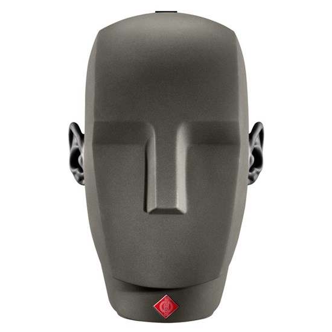
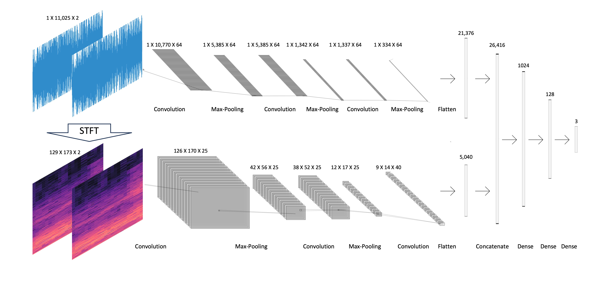

  

## Introduction

This repository presents research on "Binaural sound source localization using a hybrid time and frequency domain model".
The study was conducted as part of a thesis for Reichman University in collaboration with IRCAM Institute.
It has been accepted for presentation at the IEEE conference ICASSP 2024.

Included in this repository are an overview of the research, images illustrating data collection at Reichman University and IRCAM Institute, and a description of the model architecture. Additionally, HRIR files for each ear of every speaker in IRCAM are provided. Furthermore, there is a .py file containing the code and other tools for data processing. Moreover, it contains the thesis document, the presentation used for the thesis defense, the conference paper, and a citation for reference.

## <b>Abstract</b>

Sound source localization plays a foundational role in auditory perception, enabling both human and machines to determine the sound source location. Traditional sound localization methods often rely on manually crafted features and simplified conditions, which limit their applicability in real-world situations.

Accurate sound localization holds vital importance across diverse applications, spanning robotics, virtual reality, human-computer interactions, and medical devices. This significance is particularly amplified for individuals with cochlear implants (CI), who confront significant challenges in perceiving the direction of sound sources. 

Previous research focused on extensive microphone arrays in the frontal plane, which exhibit accuracy and robustness limitations when employing small microphone arrays. These sound localization techniques are also impractical for CI users due to size and weight constraints, and the need for full-sphere localization capabilities.

This research introduces a new approach to sound source localization using head-related transfer function (HRTF) characteristics, from raw data, in both the time and frequency domains. Furthermore, it advances binaural sound localization by extending its capabilities from a 180-degree range to a full-sphere context.

The proposed approach introduces an end-to-end Deep-Learning (DL) hybrid model, that integrates spectrogram and temporal domain insights via parallel channels. The performance of our proposed hybrid model, surpasses the current state-of-the-art results. Specifically, it boasts an average angular error of $0.24^\circ$ and an average Euclidean distance of $0.01$ meters, while the known state-of-the-art gives average angular error of $19.07^\circ$ and average Euclidean distance of $1.08$ meters.

This level of accuracy is of paramount importance for a wide range of applications, including robotics, virtual reality, and aiding individuals with CI.

In conclusion, as the field of sound source localization continues to progress, this research contributes to a deeper understanding of auditory perception and offers practical applications within healthcare scenarios.

## <b>Recording Methods</b>

  

## <b>Architecture</b>

## <b>Architecture</b>

  

  

  

## <b>Thesis paper</b>
 <b>Thesis paper - remaining</b>
 

## <b>Thesis presentation</b>

[Thesis - Gil Geva.pptx](https://github.com/GilGeva1/Binaural-sound-source-localization-using-a-hybrid-time-and-frequency-domain-model/files/14270314/Thesis.-.Gil.Geva.pptx)

## <b>ICASSP 2024</b>

[ICASSP_2024.pdf](https://github.com/GilGeva1/Binaural-sound-source-localization-using-a-hybrid-time-and-frequency-domain-model/files/14270370/ICASSP_2024.5.pdf)

## <b>arXiv paper link</b>

@article{geva2024binaural,
  title={Binaural sound source localization using a hybrid time and frequency domain model},
  author={Geva, Gil and Warusfel, Olivier and Dubnov, Shlomo and Dubnov, Tammuz and Amedi, Amir and Hel-Or, Yacov},
  journal={arXiv preprint arXiv:2402.03867},
  year={2024}
}

